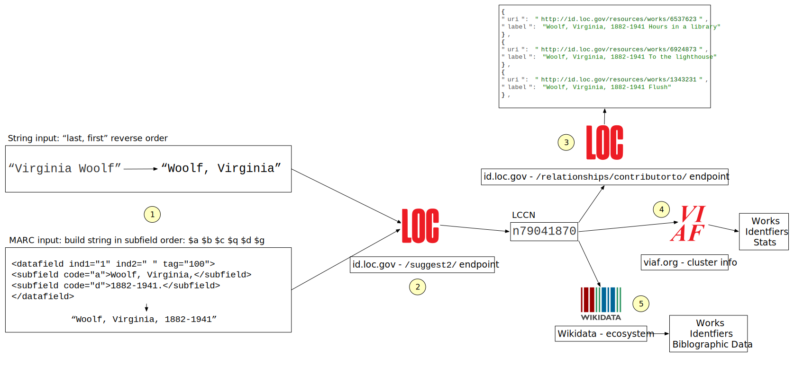

This workflow shows connecting to metadata resources via a biblographic name. The points below corospond to the number in the diagram.

#### 1

 If you have the name of an author for example you will likely have it in one of two forms, natural form, like `Virginia Woolf` or you will have what is called an authorized heading like `Woolf, Virginia, 1882-1941` . The authorized heading is a unique string in the [Library of Congress / NACO](https://www.loc.gov/aba/pcc/naco/about.html) ecosystem. If you have this heading it will be much easier to match the string to a persistent identifier. If you don't you can try to get it into a form that will be closer to the authorized form, for example with western names that would mean putting the last first.

If you have a MARC file then you likely already have the name in the authorized form, or at least the parts that can be assembled into the authorized form. The name could appear in many different MARC fields, 100, 111, 700, etc. But you will need to construct the name into the authorized heading form the subfield parts. The order of the subfields should be `$a $b $c $q $d $g` If you are using [pymarc](https://pypi.org/project/pymarc/) you can simply build the string like so:

```python
name = record['100']['a']
if 'b' in record['100']:
    name = name + ' ' + record['100']['b']
if 'c' in record['100']:
    name = name + ' ' + record['100']['c']
if 'q' in record['100']:
    name = name + ' ' + record['100']['q']                  
if 'd' in record['100']:
    name = name + ' ' + record['100']['d']   
if 'g' in record['100']:
    name = name + ' ' + record['100']['g']   

# remove the optional trailing period on all headings if there
if name[-1] == '.':
    name = name[:-1]
```


#### 2

The next step is to send this string to id.loc.gov /suggest2/ endpoint which will look through the 10+ million authorized headings and return the best match for your string. This will return the [LCCN number](https://www.loc.gov/marc/lccn_structure.html), a unique persistent identifier for this author. In python using the requests library you can make the call like this:

```python
params = {
  'q' : name,
  'count': 5
}
headers={'Accept': 'application/json', 'User-Agent': 'Your script name'}
url = f"https://id.loc.gov/authorities/names/suggest2/"
r = requests.get(url,params=params,headers=headers)
data = r.json()
results = data['hits']
```

The result will look like this:

```json
{
  "suggestLabel": "Woolf, Virginia, 1882-1941",
  "uri": "http://id.loc.gov/authorities/names/n79041870",
  "aLabel": "Woolf, Virginia, 1882-1941",
  "vLabel": "",
  "code": "",
  "rank": ""
}
...
```

The number that is part of the URI is the LCCN: [http://id.loc.gov/authorities/names/**n79041870**](http://id.loc.gov/authorities/names/n79041870)


#### 3

We can use the LCCN in a number of places, if we are interested in finding title information, what we would call "Work" metadata we can use it on id.loc.gov again using the contributor endpoint:

```python
url = 'https://id.loc.gov/resources/works/relationships/contributorto/'
params = {
  'page': 0,
  'label': 'n79041870'
}
headers={'Accept': 'application/json', 'User-Agent': 'Your script name'}
r = requests.get(url,params=params,headers=headers)
title_data = r.json()
```


The results will be a paginated list of all the Works that author has contributed to:

```json
{
	"uri": "http://id.loc.gov/resources/works/1892389",
	"label": "Woolf, Virginia, 1882-1941 To the lighthouse"
},
...
```


You can then take that URI and get the metadata in different sterilizations by adding a file extension to the URI:

RDF/XML (Verbose) - http://id.loc.gov/resources/works/1892389.rdf

N-Triples (Verbose) - http://id.loc.gov/resources/works/1892389.nt

JSON (Verbose) - http://id.loc.gov/resources/works/1892389.json

RDF/XML (Compact) - http://id.loc.gov/resources/works/1892389.bibframe.rdf

N-Triples (Compact) - http://id.loc.gov/resources/works/1892389.bibframe.nt

JSON (Compact) - http://id.loc.gov/resources/works/1892389.bibframe.json

The JSON (Compact) would probably be a good place to start. This data is in [RDF](https://en.wikipedia.org/wiki/Resource_Description_Framework) and may look a little overwhelming but in the JSON data for example you see there are a bunch of objects that represent different data graphs, the main one will be the one with the `@id` of the resource URI http://id.loc.gov/resources/works/1892389

#### 4

You can use the LCCN identifier to find the VIAF cluster which a OCLC aggregation of authority files from national libraries around the world. This is useful to find other identifiers and it also has some work information stored in VIAF. You can convert the LCCN to a VIAF URI:

```python
lccn = "n79041870"
url = f"https://viaf.org/viaf/sourceID/LC%7C{LCCN}"
r = requests.get(url,allow_redirects=False)
if r.status_code == 404:
    print("No VIAF found for that LCCN")

viaf = r.headers['Location'].split('/')[-1]
print("Found VIAF viaf LCCN",viaf)
```

You can then use that VIAF number to build a data link that looks like this: [https://viaf.org/viaf/39385478/viaf.json](https://viaf.org/viaf/39385478/viaf.json) which will return the cluster information as JSON


#### 5

You can also tap into the Wikidata ecosystem of data when you have the LCCN. You can construct a SPARQL query to search [https://query.wikidata.org/](https://query.wikidata.org/) and ask for the Q Id, which is the unique number in Wikidata for that author:

```python
lccn = "n79041870"
sparql = f"""
    SELECT ?item ?itemLabel
    WHERE 
    {{
    ?item wdt:P244 "{lccn}".
    SERVICE wikibase:label {{ bd:serviceParam wikibase:language "[AUTO_LANGUAGE],en". }}
    }}
"""
params = {
    'query' : sparql
}

headers = {
    'Accept' : 'application/json',
    'User-Agent': "The name of your process"
}
url = "https://query.wikidata.org/sparql"

r = requests.get(url, params=params, headers=headers)
data = r.json()

# did we get any results
if len(data['results']['bindings']) > 0:
  # the qid is part of the URI, chop off the identifier       
  q_id = data['results']['bindings'][0]['item']['value'].split('/')[-1]
else:
	print("LCCN Not found")
```


You can retrieve all kinds of data from Wikidata using this SPARQL method once you know the Q id or you can access the JSON data dump endpoint for that Q id: 

[https://www.wikidata.org/wiki/Special:EntityData/Q40909.json](https://www.wikidata.org/wiki/Special:EntityData/Q40909.json)

You could find all the works using the python above but [using this SPARQL instead](https://w.wiki/7mwi):

```SPARQL
SELECT ?book ?bookLabel
WHERE 
{
  ?book wdt:P50 wd:Q40909.
  SERVICE wikibase:label { bd:serviceParam wikibase:language "[AUTO_LANGUAGE],en". }
}
```


