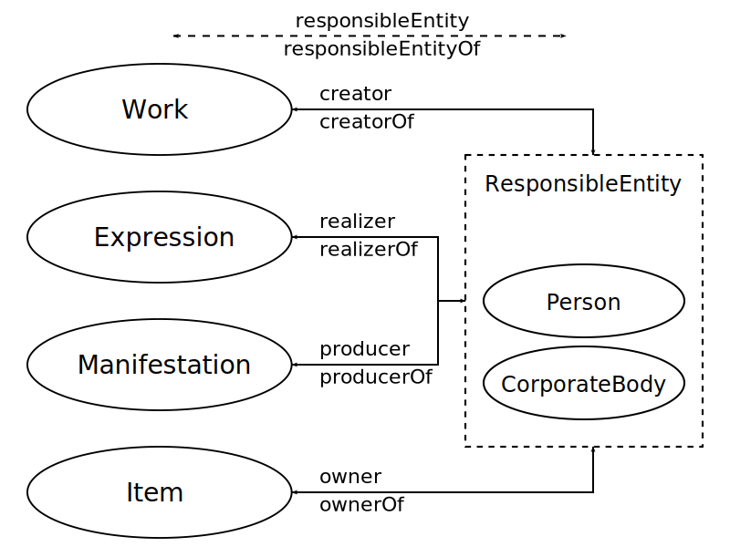
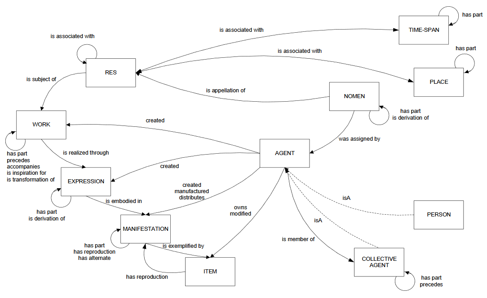
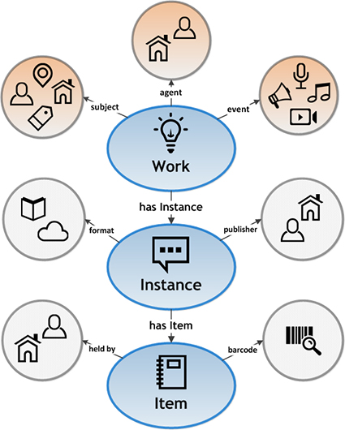

*FRBR Diagram from [Wikipedia](https://en.wikipedia.org/wiki/File:FRBR-Group-2-entities-and-relations.svg)*

Works are the top level of a hierarchical conceptual model of a bibliographic work, a book for example. A "work" is the concept created by the author and it is realized through different expressions and manifestations of that concept. For example a author could write a novel and have it published and the first edition is just one of the possible manifestations of that novel, it could published again as new edition or translated into another language. FRBR (Functional Requirements for Bibliographic Records) is a model that describes this idea. 

This FRBR model has been refined and developed over the years, one recent example is the IFLA Library Reference Model (LRM) to include other aspects of bibliographic records:

*LRM model diagram from [Wikipedia](https://commons.wikimedia.org/wiki/File:IFLA-LRM_Overview_of_Relationships.png)*

However how these conceptual models are actually implemented in data structures can vary. For example Bibframe has omitted/collapsed the Expression level of the FRBR model:

*Bibframe 2.0 diagram from [LOC](https://www.loc.gov/bibframe/docs/bibframe2-model.html)*

The main idea however is that when you think of a book, it is not just a singular entity, it is a hierarchy, for a lot of practical applications outside of bibliographic systems in libraries you really only are interested in the Work level of the hierarchy which likely represents all the different editions, and translations and other permutations to the work over the years. For example a ISBN identifier is a manifestation or instance level identifier, it could only be representing the metadata for a single edition of a work or a translation. If you are interested in the larger picture you would rather have work metadata that is constant over all variations of the execution of the work. You would also want a work identifier that uniquely identifies that work.

The idea of a work identifier is fairly new, so the process of creating these identifiers is not a common as say a ISBN or other instance level identifiers. There are some sources though of work identifiers that can be leveraged. Here is a list of Work identifier ecosystems that can get you started:

* Name Title Authorities: These are authorized constructed string headings that uniquely identify a work. They exist in many authority files in many national libraries. For example [Woolf, Virginia, 1882-1941. To the lighthouse](https://id.loc.gov/authorities/names/no2017122683.html) in the Library of Congress. This Name Title authority combines the authorized heading for the creator and the name of the work. They are created in the cataloging process, but not everything gets a Name Title Authority created for it. You can find these at [id.loc.gov](https://id.loc.gov/) for ones created in the United States and at [viaf.org](viaf.org) for international libraries.
* You can also fine Works and Hub (super works) identifiers at [id.loc.gov](https://id.loc.gov/) which represent the Work level.
* OCLC's [Classify service](http://classify.oclc.org/classify2/) has Work identifiers as well as a interface to search them.
* OCLC's next generation of Entity management has work identifiers at [https://id.oclc.org/worldcat/entity](https://id.oclc.org/worldcat/entity) which will likely be a replacement for Classify (though no APIs available as of now in late 2023)
* Open Library has Work identifiers, and a [dump file](https://openlibrary.org/developers/dumps) you can use to access them.
*  Google seems to also have some Work identifier in its records and returned in some of its [API responses](https://developers.google.com/books).
* [Share-VDE](https://wiki.share-vde.org/wiki/ShareVDE:Resources) also has the concept of Works and Super Works. 

